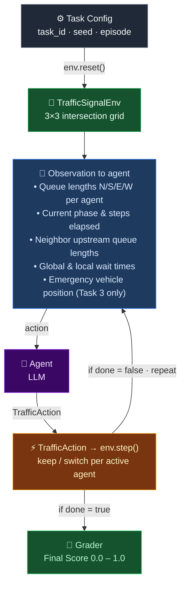

# TrafficSignalEnv

> [!NOTE]
> This is a submission for the **Scaler × OpenEnv Hackathon**.

A cooperative multi-agent RL environment for adaptive traffic signal control across a 3x3 grid of intersections. Perfect for testing multi-agent coordination policies and demonstrating environment usage patterns.

Urban traffic congestion costs the global economy over $1 trillion annually. Adaptive traffic signal control represents one of the highest-impact applications of multi-agent reinforcement learning, where independent agents controlling individual intersections must learn to coordinate without centralized control.

## Quick Start

The simplest way to use the TrafficSignalEnv environment is through the `TrafficSignalEnv` class:

```python
import asyncio
from client import TrafficSignalEnv
from models import TrafficAction, AgentAction

async def main():
    try:
        # Create environment from Docker image
        env = await TrafficSignalEnv.from_docker_image("openenv-traffic-signal:latest")

        # Reset with a specific task
        result = await env.reset(seed=42, task_id="corridor_coordination")
        obs = result.observation
        print(f"Reset: step={obs.step}, global_wait={obs.global_wait_time:.2f}")

        # Run until done
        while not obs.done:
            action = TrafficAction(
                agent_actions=[
                    AgentAction(agent_id=a.agent_id, phase_action="keep")
                    for a in obs.agents
                ]
            )
            result = await env.step(action)
            obs = result.observation
            print(f"Step {obs.step}: wait={obs.global_wait_time:.2f}, reward={result.reward:.3f}")

        print(f"Final score: {result.reward}")

    finally:
        # Always clean up
        await env.close()

asyncio.run(main())
```

That's it! The `TrafficSignalEnv.from_docker_image()` method handles:

- Starting the Docker container
- Waiting for the server to be ready
- Connecting to the environment
- Container cleanup when you call `close()`

## Building the Docker Image

Before using the environment, you need to build the Docker image:

```bash
# From project root
docker build -t openenv-traffic-signal:latest .
```

## Deploying to Hugging Face Spaces

You can easily deploy your OpenEnv environment to Hugging Face Spaces using the `openenv push` command:

```bash
# From the environment directory (where openenv.yaml is located)
openenv push

# Or specify options
openenv push --namespace my-org --private
```

The `openenv push` command will:

1. Validate that the directory is an OpenEnv environment (checks for `openenv.yaml`)
2. Prepare a custom build for Hugging Face Docker space (enables web interface)
3. Upload to Hugging Face (ensuring you're logged in)

### Prerequisites

- Authenticate with Hugging Face: The command will prompt for login if not already authenticated

### Options

- `--directory`, `-d`: Directory containing the OpenEnv environment (defaults to current directory)
- `--repo-id`, `-r`: Repository ID in format 'username/repo-name' (defaults to 'username/env-name' from openenv.yaml)
- `--base-image`, `-b`: Base Docker image to use (overrides Dockerfile FROM)
- `--private`: Deploy the space as private (default: public)

### Examples

```bash
# Push to your personal namespace (defaults to username/env-name from openenv.yaml)
openenv push

# Push to a specific repository
openenv push --repo-id my-org/my-env

# Push with a custom base image
openenv push --base-image ghcr.io/meta-pytorch/openenv-base:latest

# Push as a private space
openenv push --private

# Combine options
openenv push --repo-id my-org/my-env --base-image custom-base:latest --private
```

After deployment, your space will be available at:
`https://huggingface.co/spaces/<repo-id>`

The deployed space includes:

- **Web Interface** at `/web` - Interactive UI for exploring the environment
- **API Documentation** at `/docs` - Full OpenAPI/Swagger interface
- **Health Check** at `/health` - Container health monitoring
- **WebSocket** at `/ws` - Persistent session endpoint for low-latency interactions

## Environment Details

### Environment Overview

A 3x3 grid of intersections, each controlled by an independent agent:

```
    N       N       N
    |       |       |
W--[0]----[1]----[2]--E
    |       |       |
W--[3]----[4]----[5]--E
    |       |       |
W--[6]----[7]----[8]--E
    |       |       |
    S       S       S
```

Each intersection has 4 incoming lanes (N, S, E, W) and cycles through 4 signal phases:

- Phase 0: NS green, EW red
- Phase 1: NS yellow, EW red (transition)
- Phase 2: EW green, NS red
- Phase 3: EW yellow, NS red (transition)

Vehicles spawn at intersections according to a Poisson process and traverse the grid toward their destinations. Green signals allow one vehicle per step per lane to advance.

### Agent Loop



### Tasks

| Task ID                 | Difficulty | Active Agents         | Max Steps | Core Challenge                                                   |
| ----------------------- | ---------- | --------------------- | --------- | ---------------------------------------------------------------- |
| `corridor_coordination` | Easy       | 3 (intersections 0-2) | 150       | Learn green wave along a corridor                                |
| `grid_coordination`     | Medium     | 9 (full 3x3 grid)     | 200       | Minimize global wait across all directions                       |
| `emergency_response`    | Hard       | 9 (full 3x3 grid)     | 200       | Clear path for emergency vehicle while managing civilian traffic |

<div align="center">


</div>

### Action

**TrafficAction**: Contains one action per active agent

| Field                          | Type                 | Description                      |
| ------------------------------ | -------------------- | -------------------------------- |
| `agent_actions`                | `List[AgentAction]`  | One action per active agent      |
| `agent_actions[].agent_id`     | `int`                | Intersection ID (0-8)            |
| `agent_actions[].phase_action` | `"keep" \| "switch"` | Maintain or change current phase |

Constraints:

- `switch` only takes effect during green phases (0 or 2)
- Minimum 5 steps in green before switching is allowed
- Yellow phases (1, 3) auto-advance and cannot be interrupted

### Observation

**TrafficObservation**: Contains per-agent state and global metrics

| Field                      | Type                            | Description                                           |
| -------------------------- | ------------------------------- | ----------------------------------------------------- |
| `task_id`                  | `str`                           | Current task identifier                               |
| `episode_id`               | `str`                           | Unique episode identifier                             |
| `step`                     | `int`                           | Current step number                                   |
| `agents`                   | `List[IntersectionObservation]` | Per-agent state                                       |
| `agents[].queue_lengths`   | `List[float]`                   | Vehicles waiting in N, S, E, W lanes                  |
| `agents[].current_phase`   | `int`                           | Signal phase (0-3)                                    |
| `agents[].phase_elapsed`   | `int`                           | Steps in current phase                                |
| `agents[].neighbor_queues` | `List[float]`                   | Outgoing queues of N/S/E/W neighbors                  |
| `agents[].local_wait_time` | `float`                         | Mean wait time at this intersection                   |
| `global_wait_time`         | `float`                         | Mean wait time across all intersections               |
| `reward`                   | `float`                         | Reward for the last action                            |
| `final_score`              | `float \| null`                 | Final grader score in [0, 1]; set at episode end only |
| `emergency_vehicle`        | `EmergencyVehicleState?`        | Emergency vehicle state (Task 3 only)                 |
| `done`                     | `bool`                          | Whether the episode has ended                         |

### Reward

The reward signal is dense and combines two components:

```
wait_improvement = (prev_wait - new_wait) / (baseline_wait + epsilon)
efficiency = max(0, 1 - new_wait / (baseline_wait + epsilon))
reward = 0.7 * wait_improvement + 0.3 * efficiency
```

For the emergency response task, the reward is further weighted:

```
reward = 0.6 * traffic_reward + 0.4 * emergency_delta
```

This design incentivizes both immediate improvements (wait reduction between steps) and sustained efficiency (staying below baseline).

### Grader Design

All graders are **pure deterministic functions** with no LLM judges. This ensures:

- **Reproducibility**: Same seed + same actions = identical score, every time
- **Transparency**: Scoring formulas are visible in `graders/`
- **Speed**: No API calls during evaluation
- **Fairness**: No stochastic judge variance between runs

Grading formulas:

- **Corridor**: `score = 1 - (agent_time / baseline_time)`
- **Grid**: `score = 1 - (agent_wait / baseline_wait)`
- **Emergency**: `score = 0.6 * (1 - emergency_time / max_time) + 0.4 * (1 - civilian_wait / baseline_wait)`

All scores are clipped to [0.0, 1.0].

### Baseline Scores

| Task                    | Mean Score | Min | Max |
| ----------------------- | ---------- | --- | --- |
| `corridor_coordination` | TBD        | TBD | TBD |
| `grid_coordination`     | TBD        | TBD | TBD |
| `emergency_response`    | TBD        | TBD | TBD |

_Scores to be filled after running inference.py with a baseline LLM agent._

## Advanced Usage

### Connecting to an Existing Server

If you already have a TrafficSignalEnv server running, you can connect directly:

```python
from client import TrafficSignalEnv

# Connect to existing server
env = TrafficSignalEnv(base_url="<ENV_HTTP_URL_HERE>")

# Use as normal
result = await env.reset(seed=42, task_id="grid_coordination")
result = await env.step(action)
```

Note: When connecting to an existing server, `env.close()` will NOT stop the server.

### Using the Context Manager

The client supports context manager usage for automatic connection management:

```python
import asyncio
from client import TrafficSignalEnv
from models import TrafficAction, AgentAction

async def main():
    # Connect with context manager (auto-connects and closes)
    async with TrafficSignalEnv(base_url="http://localhost:8000") as env:
        result = await env.reset(seed=42, task_id="corridor_coordination")
        obs = result.observation
        # Multiple steps with low latency
        while not obs.done:
            action = TrafficAction(
                agent_actions=[
                    AgentAction(agent_id=a.agent_id, phase_action="keep")
                    for a in obs.agents
                ]
            )
            result = await env.step(action)
            obs = result.observation
            print(f"Step {obs.step}: wait={obs.global_wait_time:.2f}")

asyncio.run(main())
```

The client uses WebSocket connections for:

- **Lower latency**: No HTTP connection overhead per request
- **Persistent session**: Server maintains your environment state
- **Efficient for episodes**: Better for many sequential steps

### Concurrent WebSocket Sessions

The server supports multiple concurrent WebSocket connections. To enable this,
modify `server/app.py` to use factory mode:

```python
# In server/app.py - use factory mode for concurrent sessions
app = create_app(
    TrafficSignalEnvironment,  # Pass class, not instance
    TrafficAction,
    TrafficObservation,
    max_concurrent_envs=4,  # Allow 4 concurrent sessions
)
```

Then multiple clients can connect simultaneously:

```python
import asyncio
from client import TrafficSignalEnv
from models import TrafficAction, AgentAction

async def run_episode(seed: int):
    async with TrafficSignalEnv(base_url="http://localhost:8000") as env:
        result = await env.reset(seed=seed, task_id="grid_coordination")
        obs = result.observation
        while not obs.done:
            action = TrafficAction(
                agent_actions=[
                    AgentAction(agent_id=a.agent_id, phase_action="keep")
                    for a in obs.agents
                ]
            )
            result = await env.step(action)
            obs = result.observation
        return seed, result.reward

# Run 4 episodes concurrently
async def main():
    results = await asyncio.gather(*[run_episode(seed) for seed in range(4)])
    for seed, score in results:
        print(f"Seed {seed}: score={score:.3f}")

asyncio.run(main())
```

## Development & Testing

### Running Tests

Test the environment logic directly without starting the HTTP server:

```bash
uv run pytest tests/
```

### Running Locally

Run the server locally for development:

```bash
uv run uvicorn server.app:app --reload --port 8000
```

### Running Inference

`inference.py` runs one episode of the LLM agent against the environment. It requires a running server and API credentials.

**1. Start the server** (in a separate terminal):

```bash
uv run uvicorn server.app:app --host 127.0.0.1 --port 8000
```

**2. Set credentials** — the script reads these from environment variables or a `.env` file:

| Variable       | Description                                                      |
| -------------- | ---------------------------------------------------------------- |
| `HF_TOKEN`     | Your Hugging Face API key (or set `API_KEY` for other providers) |
| `API_BASE_URL` | LLM API endpoint (default: `https://router.huggingface.co/v1`)   |
| `MODEL_NAME`   | Model identifier (default: `Qwen/Qwen2.5-72B-Instruct`)          |

**3. Run each task** using the `TRAFFIC_TASK` environment variable:

```bash
# Easy — corridor green wave (3 agents, 150 steps)
TRAFFIC_TASK=corridor_coordination uv run python inference.py

# Medium — full grid coordination (9 agents, 200 steps)
TRAFFIC_TASK=grid_coordination uv run python inference.py

# Hard — emergency vehicle response (9 agents, 200 steps)
TRAFFIC_TASK=emergency_response uv run python inference.py
```

Each command prints structured output to stdout:

```
[START] task=corridor_coordination env=traffic_signal model=Qwen2.5-72B-Instruct
[STEP] step=1 action={0:keep,1:keep,2:keep} reward=0.22 done=false error=null
...
[END] success=true steps=150 score=0.64 rewards=0.22,0.21,...
```

Pass `--write` to also save output to `outputs/<task>_ep<n>.txt`:

```bash
TRAFFIC_TASK=grid_coordination uv run python inference.py --write
```

Additional options via environment variables:

| Variable          | Description                          | Default                 |
| ----------------- | ------------------------------------ | ----------------------- |
| `TRAFFIC_ENV_URL` | Server URL                           | `http://localhost:8000` |
| `TRAFFIC_EPISODE` | Episode index (controls random seed) | `0`                     |

To connect to a remote server instead of running locally, set `TRAFFIC_ENV_URL`:

```bash
TRAFFIC_ENV_URL=https://your-space.hf.space \
TRAFFIC_TASK=grid_coordination \
  uv run python inference.py
```

You can also validate the environment before running:

```bash
uv run openenv validate
```

## Project Structure

```
openenv-traffic-signal/        # repo root
├── README.md
├── openenv.yaml               # OpenEnv manifest
├── pyproject.toml             # Project metadata and dependencies
├── uv.lock                    # Locked dependencies (generated)
├── conftest.py                # Pytest configuration
├── __init__.py                # Package exports
├── client.py                  # TrafficSignalEnv client
├── models.py                  # Action and Observation models
├── inference.py               # LLM agent inference script
├── tests/                     # Test suite
├── docs/images/                    # Task diagrams
├── graders/                   # Deterministic grading functions
├── simulator/                 # Traffic simulation core
└── server/
    ├── Dockerfile             # Container image definition
    ├── app.py                 # FastAPI application (HTTP + WebSocket endpoints)
    └── traffic_signal_environment.py  # Core environment logic
```

## Multi-Agent Architecture

TrafficSignalEnv uses a **cooperative independent learners** architecture:

- **Independent**: Each agent makes its own keep/switch decision based on local observation
- **Cooperative**: All agents share a single global reward signal (mean wait time reduction)
- **Partial observability**: Agents see their own queues and partial neighbor state, but not the full grid

This design sits between fully centralized control (single agent controlling all signals, which doesn't scale) and fully independent agents (no coordination signal). The shared reward naturally incentivizes emergent coordination: agents learn that their local decisions affect global performance, encouraging patterns like green waves.

### Why Not Centralized?

A centralized controller would have a combinatorial action space of `2^9 = 512` joint actions. The independent formulation keeps each agent's action space at 2, while the shared reward provides the coordination pressure. This mirrors real-world constraints where traffic controllers operate independently but contribute to system-level objectives.

### Why Not Fully Independent?

Purely independent agents with separate reward functions would optimize locally, leading to oscillations and conflicting green phases at adjacent intersections. The shared reward ensures agents account for downstream effects of their decisions.

## Citation

```bibtex
@software{trafficsignalenv2026,
  title   = {TrafficSignalEnv: Cooperative Multi-Agent RL for Adaptive Traffic Signal Control},
  author  = {Madhurjya Roy},
  year    = {2026},
  url     = {https://huggingface.co/spaces/mroyme/openenv-traffic-signal},
  note    = {OpenEnv-compatible environment for multi-agent traffic signal coordination}
}
```
